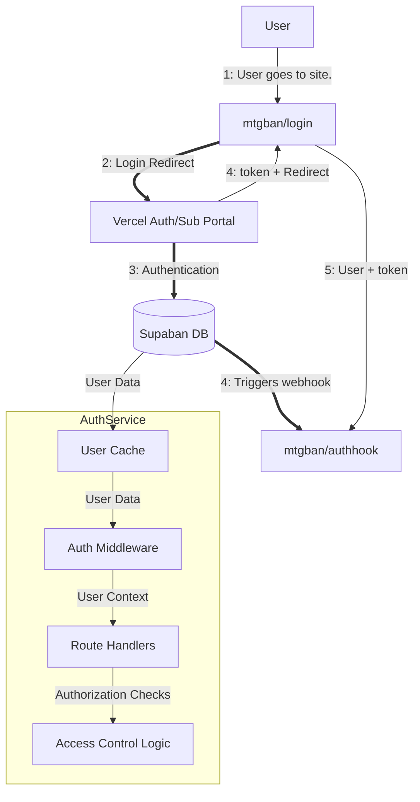

# Authentication System Documentation

## System Overview



---
## Architecture

### Core Components

- **AuthService**: Central service coordinating authentication and authorization
- **UserCache**: In-memory cache for user data with TTL and periodic cleanup
- **SupabaseUserRepository**: Data access layer for Supabase integration
- **WebhookHandler**: Processes real-time updates from Supabase
- **Middleware**: HTTP request interceptors for auth enforcement

### Data Models

- **UserData**: Core user entity with identity, permissions, and features
- **Role**: Administrative permission levels (Root, Admin, Moderator, etc.)
- **Tier**: Subscription levels (Free, Pioneer, Modern, Legacy, etc.)
- **Feature**: Application features that can be access-controlled
- **Status**: Subscription status (Active, Inactive, Cancelled)

### Auth Config
```json
{
  "role_acl": {
    "Admin": ["admin", "root"],
    "Moderation": ["moderator", "admin", "root"]
  },
  "tier_acl": {
    "Premium": ["vintage", "legacy"],
    "Basic": ["pioneer", "modern", "legacy", "vintage"],
    "...": ["..."]
  },
  "feature_flags": {
    "Search": {
      "can_download_csv": true,
      "can_filter_by_price": true
    },
    "..."
  },
  "supabase": {
    "refresh_interval": "24h",
    "supabase_url": "https://example.supabase.co",
    "supabase_key": "supa-secret",
    "supabase_secret": "supa-secret-jwt-edition"
  }
}
```
### Benefits

1. **Real-time permission updates**: Webhooks ensure the cache reflects the latest user permissions
2. **High performance**: In-memory cache eliminates database queries for each request
3. **Fine-grained access control**: Three-level permission system with flexible feature flags
4. **Separation of concerns**: Authentication portal handles login UI, server handles authorization
5. **Scalability**: Cache can be distributed or replaced with Redis for multi-server setups

## Auth Cycle
### External Authentication Process (Vercel/Supabase)

1. User visits the main website
2. User clicks "Login" button
3. Website redirects to NextJS auth portal with return URL
4. User authenticates with credentials at portal
5. Portal authenticates with Supabase
6. Portal updates user data in Supabase
7. Supabase sends webhook notification to server with user data
8. Server updates user cache based on webhook data
9. Portal generates JWT with user ID
10. Portal redirects user back to main site with JWT
11. Main site stores JWT locally (cookie/localStorage)

### Server Authentication Process (thats us!)

12. User makes request to protected endpoint with JWT
13. Middleware extracts JWT and identifies user
14. User data is retrieved from cache
15. User context is established for the request
16. Access controls are applied based on user permissions
17. Handler processes request and applies fine-grained permissions
18. Template renders with permission-aware variables

### Initial Server Setup

We init authsystem on startup:

```go
// Initialize Supabase client
client, err := InitSupabaseClient(url, anonKey)

config, err := LoadDefaultAuthConfig()

authService, err := NewAuthService(client, config)

RegisterWebhookHandlers(mux, authService)

setupRoutes(mux, authService, middlewareConfig)
```

The `authService.cache` is initialized and loaded with initial user data from Supabase via `LoadInitialData`.

### User Authentication

1. Client sends JWT token in request header
2. Middleware extracts and validates token
3. User ID is extracted from token claims
4. User data is retrieved from cache or database
5. User context is established for the request

```go
// Extract token from request
token := extractToken(r)
if token == "" {
    http.Error(w, `{"error":"missing token"}`, http.StatusUnauthorized)
    return
}

// Get user from token
user, err := getUserFromToken(ctx, authService, token, jwtSecret)
if err != nil {
    http.Error(w, `{"error":"invalid or expired token"}`, http.StatusUnauthorized)
    return
}

// Add user to context
ctx = context.WithValue(ctx, auth.UserContextKey, user)
```

### Hookers Pt.1

When user data changes in Supabase (signup, plan changes, etc.), webhooks update the cache:

```go
// In webhook.go
func (h *WebhookHandler) HandleWebhook(w http.ResponseWriter, r *http.Request) {
    // Parse webhook payload
    payload, err := h.parseWebhookPayload(r.Body)
    
    // Process based on operation type
    switch payload.Type {
    case "INSERT", "UPDATE":
        h.handleUserUpsert(ctx, payload.Record)
    case "DELETE":
        h.handleUserDelete(ctx, payload.Record)
    }
}

// handleUserUpsert updates the cache with new/updated user data
func (h *WebhookHandler) handleUserUpsert(ctx context.Context, record map[string]interface{}) error {
    userData, err := h.service.parseUserData(record)
    h.service.cache.SetUser(userData)
    return nil
}
```
This ensures the user cache is always up-to-date without direct database queries for each request.


# 3-tier Access Control
The system implements a multi-level permission system:

### Roles
Roles provide administrative permissions without requiring a subscription:

- **Root**: Highest level access
- **Admin**: Full administrative access
- **Moderator**: Content moderation capabilities
- **Developer**: Technical access for development
- **LostBoy**: Special role with custom permissions(i think)

### Tiers
Tiers bring in that chedda', and are arranged in an hierarchy (except API):  
`TierVintage → TierLegacy → TierModern → TierPioneer → TierFree`
- **Free**: Basic access (no subscription)
- **Pioneer**: Entry-level subscription
- **Modern**: Mid-tier subscription
- **Legacy**: Higher-tier subscription
- **Vintage**: Premium subscription
- **API**: API-only access

```go
type Tier string

const (
    TierFree    Tier = "free"
    TierPioneer Tier = "pioneer"
    TierModern  Tier = "modern"
    TierLegacy  Tier = "legacy"
    TierVintage Tier = "vintage"
    TierAPI     Tier = "api"
)

// TierConfig defines the configuration for all tiers
var TierConfig = map[Tier]TierProperties{
    TierFree:    {Subscribed: false, Hierarchy: []Tier{}},
    TierAPI:     {Subscribed: true, Hierarchy: []Tier{}},
    TierPioneer: {Subscribed: true, Hierarchy: []Tier{TierFree}},
    TierModern:  {Subscribed: true, Hierarchy: []Tier{TierFree, TierPioneer}},
    TierLegacy:  {Subscribed: true, Hierarchy: []Tier{TierFree, TierPioneer, TierModern}},
    TierVintage: {Subscribed: true, Hierarchy: []Tier{TierFree, TierPioneer, TierModern, TierLegacy}},
}
```


### Feature-
Features represent application pages:

- **Search**: Search functionality
- **Newspaper**: News-related features
- **Sleepers**: Sleeper functionality
- **Upload**: Upload capabilities
- **Global**: Global settings
- **Arbit**: Arbitrage functionality
- **Reverse**: Reverse lookup functionality
- **Admin**: Administrative functions

```go
type Feature string

const (
    Search    Feature = "Search"
    Newspaper Feature = "Newspaper"
    Sleepers  Feature = "Sleepers"
    Upload    Feature = "Upload"
    Global    Feature = "Global"
    Arbit     Feature = "Arbit"
    Reverse   Feature = "Reverse"
    Admin     Feature = "Admin"
)
```

### -Flags
Flags provide fine-grained control over specific functionality within features:

```json
{
  "Search": {
    "Global": {
      "can_download_csv": "true",
      "can_filter_by_price": "true"
    }
  },
  "Upload": {
    "Buylist": {
      "enabled": "true",
      "can_change_stores": "false"
    }
  }
}
```
## Caching System

### Cache Structure
The system implements an in-memory cache for user data:

```go
type UserCache struct {
    users           sync.Map
    lastSync        time.Time
    mu              sync.RWMutex
    logger          *log.Logger
    cleanupInterval time.Duration
    defaultTTL      time.Duration
    gracePeriod     time.Duration
}
```

### Cache Operations

- **GetUser**: Retrieves user data from cache
- **SetUser**: Stores user data in cache with TTL
- **DeleteUser**: Removes user data from cache
- **LoadInitialData**: Bulk loads users into cache
- **ForceRefresh**: Manually refreshes cache data

### Cache Maintenance

The cache automatically maintains itself through:

- **Periodic Cleanup**: Removes expired entries
- **Periodic Refresh**: Refreshes data from the database
- **TTL with Grace Period**: Entries expire after TTL but can still be used during grace period


### Hookers Pt2: The Hookening
## Registration
```go
func RegisterWebhookHandlers(router *http.ServeMux, authService *AuthService) {
    handler := NewWebhookHandler(authService, authService.config.SBase.SupabaseSecret)
    handlerChain := handler.EnforceWebhookSigning(
        http.HandlerFunc(handler.HandleWebhook),
    )
    router.Handle("/admin/updates", handlerChain)
    router.Handle("/webhook/auth", handlerChain)
}
```

## Event Processing

The system handles three webhook event types:

- **INSERT**: New user or subscription
- **UPDATE**: Changed user data or subscription
- **DELETE**: Removed user or subscription

## Security

Webhooks are secured through:

- **Secret Validation**: Checks webhook signature
- **Size Limiting**: Prevents payload abuse
- **Timeouts**: Limits processing time
- **Content Validation**: Verifies payload structure

# Middlewares

### Authentication Middleware

```go
func (cfg *MiddlewareConfig) APIAuthMiddleware(next http.Handler) http.Handler {
    return http.HandlerFunc(func(w http.ResponseWriter, r *http.Request) {
        // Extract and validate token
        // Get user from token
        // Check permissions
        // Add user to context
        next.ServeHTTP(w, r.WithContext(ctx))
    })
}
```

### Feature Access Middleware

```go
func (cfg *MiddlewareConfig) FeatureAccessMiddleware(feature string) func(http.Handler) http.Handler {
    return func(next http.Handler) http.Handler {
        return http.HandlerFunc(func(w http.ResponseWriter, r *http.Request) {
            // Get user from context
            // Check feature access
            next.ServeHTTP(w, r)
        })
    }
}
```

### User Data Structure

```go
type UserData struct {
    ID       string                                  `json:"id"`
    Email    string                                  `json:"email"`
    Role     *Role                                   `json:"role"`     // Administrative role
    Tier     Tier                                    `json:"tier"`     // Subscription tier
    Status   Status                                  `json:"status"`   // Subscription status
    Features map[string]map[string]map[string]string `json:"features"` // Feature flags
}
```
`UserData` is the core of the permission system and is populated from Supabase data.

technically has (and does use) 3 methods of checking access, but only 1 is exposed:

```go
// Check role-based access
func (u *UserData) hasRoleAccess(requiredRole Role) bool {
    // no role, no access -> check tier next
    if u.Role == nil {
        return false
    }

    // Direct match -> stop checking, access granted
    if *u.Role == requiredRole {
        return true
    }

    // Admin role has access to everything
    if *u.Role == RoleAdmin {
        return true
    }

    return false
}

// Check tier-based access
func (u *UserData) hasTierAccess(requiredTier Tier) bool {
    // no tier, no access -> check individual flags next
    if u.Tier == "" {
        return false
    }

    // Direct match -> see above
    if u.Tier == requiredTier {
        return true
    }

    // Check tier hierarchy -> this is that no extra checks needed part i mentioned earlier
    props, exists := TierConfig[u.Tier]
    if !exists {
        return false
    }
    return slices.Contains(props.Hierarchy, requiredTier)
}

// Check feature-based access
func (u *UserData) hasFeatureAccess(requiredFeature Feature) (bool, map[string]map[string]string) {
    if u.Features == nil {
        return false, nil
    }
    // If flag is set, you're in. if not? get fucked kid
    for feature, value := range u.Features {
        if feature == string(requiredFeature) {
            return true, value
        }
    }
    return false, nil
}
```

These are combined in the  `HasAccess` method, which is what we use to check. mostly.

```go
func (u *UserData) HasAccess(accessType AccessType, required interface{}) bool {
    switch accessType {
    case RoleAccess:
        if role, ok := required.(Role); ok && role != "" {
            return u.hasRoleAccess(role)
        }
    case TierAccess:
        if tier, ok := required.(Tier); ok && tier != "" {
            return u.hasTierAccess(tier)
        }
    case FeatureAccess:
        if feature, ok := required.(Feature); ok && feature != "" {
            hasFeature, _ := u.hasFeatureAccess(feature)
            return hasFeature
        }
    }
    return false
}
```

```go
// In handlers file
func SearchPage(w http.ResponseWriter, r *http.Request) {
    // Get user from context (already authenticated by middleware)
    user := r.Context().Value(auth.UserContextKey).(*auth.UserData)
    
    // Prepare page variables
    pageVars := map[string]interface{}{
        "Title": "Search",
        // other variables
    }
    
    // Apply auth-specific variables to template context
    authService.ApplyAuthVarsToPageVars(user, pageVars)
    
    // Render the template with permissions
    renderTemplate(w, "search.html", pageVars)
}
```

### UserCache Implementation

```go
type UserCache struct {
    users           sync.Map
    lastSync        time.Time
    mu              sync.RWMutex
    logger          *log.Logger
    cleanupInterval time.Duration
    defaultTTL      time.Duration
    gracePeriod     time.Duration
}

// GetUser retrieves a user from cache
func (c *UserCache) GetUser(id string) (*UserData, error) {
    entry, ok := c.users.Load(userID(id))
    if !ok {
        return nil, nil
    }
    
    cacheEntry := entry.(*cacheEntry)
    if cacheEntry.isExpired() {
        // Grace period logic
        if c.gracePeriod > 0 && time.Now().Sub(cacheEntry.expiry) <= c.gracePeriod {
            return cacheEntry.data, nil
        }
        
        c.DeleteUser(id)
        return nil, ErrEntryExpired
    }
    
    return cacheEntry.data, nil
}
```
The cache eliminates the need for database queries on each request and provides features like TTL and grace periods.


```go
type AuthVars struct {
    CanShowAll            bool
    CanDownloadCSV        bool
    IsOneDay              bool
    GlobalMode            bool
    ReverseMode           bool
    CanFilterByPrice      bool
    CanFilterByPercentage bool
    CanBuylist            bool
    CanChangeStores       bool

    // User info
    UserID    string
    UserEmail string
    UserTier  *Tier
    UserRole  *Role
}
```

The `ApplyAuthVarsToPageVars` function is responsible for mapping user authentication data to page variables:

```go
func (s *AuthService) ApplyAuthVarsToPageVars(user *UserData, pageVars map[string]interface{}) {
    if user == nil || pageVars == nil {
        return
    }

    // Set basic user info
    pageVars["UserID"] = user.ID
    pageVars["UserEmail"] = user.Email
    pageVars["UserTier"] = user.Tier
    pageVars["UserRole"] = user.Role

    // Set flag for having any features enabled
    pageVars["HasFeatures"] = user.Features

    // First, map HasAccess for each feature (top-level access)
    for _, feature := range AllFeatures() {
        featureStr := string(feature)
        pageVars["Has"+featureStr] = user.Features[featureStr]
        pageVars["Can"+featureStr] = user.Features[featureStr]
    }

    // Then, dynamically map feature flags
    if user.Features != nil {
        // For each category in Features (Search, Newspaper, etc.)
        for category, features := range user.Features {
            // For each feature set in the category
            for featureSet, settings := range features {
                // For each setting/flag in the feature set
                for flagName, flagValue := range settings {
                    // Create different types of keys for the PageVars

                    // Full path as key (e.g., "Search.Global.CanDownloadCSV")
                    fullPath := category + "." + featureSet + "." + flagName
                    pageVars[fullPath] = flagValue

                    // Map directly by flag name
                    pageVars[flagName] = flagValue

                    // Map with Can/Is/Has prefix based on type
                    if IsBooleanValue(flagValue) {
                        boolValue := (flagValue == "true" || flagValue == "enabled" || 
                                     flagValue == "yes" || flagValue == "1")

                        // Key with proper prefix
                        var prefixedKey string
                        if strings.HasPrefix(flagName, "Can") || 
                           strings.HasPrefix(flagName, "Is") || 
                           strings.HasPrefix(flagName, "Has") {
                            prefixedKey = flagName
                        } else if strings.HasSuffix(flagName, "Enabled") {
                            // Convert -> Enabled -> Can
                            name := strings.TrimSuffix(flagName, "Enabled")
                            prefixedKey = "Can" + name
                        } else if strings.HasSuffix(flagName, "Disabled") {
                            // Convert -> Disabled -> Can (inverted)
                            name := strings.TrimSuffix(flagName, "Disabled")
                            prefixedKey = "Can" + name
                            // Special case: if the value is "NONE", it means "enabled"
                            if flagValue == "NONE" {
                                boolValue = true
                            } else {
                                boolValue = !boolValue
                            }
                        } else {
                            // Convert -> Can
                            prefixedKey = "Can" + flagName
                        }
                        // Set the boolean value with the appropriate key
                        pageVars[prefixedKey] = boolValue
                    }
                }
            }
        }
    }
}
```

The mapping follows these conventions:

1. **Direct Properties**:
   ```
   pageVars["UserID"] = user.ID
   pageVars["UserEmail"] = user.Email
   ```
2. **Has/Can Feature Access**:
   ```
   pageVars["HasSearch"] = true/false
   pageVars["CanUpload"] = true/false
   ```
3. **Feature Path Variables**:
   ```
   pageVars["Search.Global.CanDownloadCSV"] = "true"
   ```
4. **Boolean Feature Flags**:
   ```
   pageVars["CanDownloadCSV"] = true/false
   ```
5. **"Smart" Prefix Handling**:
   - Properties ending with "Enabled" convert to "Can" prefix
   - Properties ending with "Disabled" convert to "Can" prefix (with value inversion)
   - Properties already starting with "Can/Is/Has" keep their prefix
---

Given a user with these features:
```json
{
  "Search": {
    "Global": {
      "can_download_csv": "true",
      "filter_by_price_enabled": "true"
    }
  },
  "Upload": {
    "Buylist": {
      "enabled": "true",
      "change_stores_disabled": "ALL"
    }
  }
}
```
The resulting PageVars should include:
```go
// Direct properties
pageVars["UserID"] = "user123"
pageVars["UserEmail"] = "user@example.com"

// Feature access flags
pageVars["HasSearch"] = true
pageVars["HasUpload"] = true

// Full path properties
pageVars["Search.Global.can_download_csv"] = "true"
pageVars["Search.Global.filter_by_price_enabled"] = "true"

// Direct flag values
pageVars["can_download_csv"] = "true"
pageVars["filter_by_price_enabled"] = "true"

// Boolean conversions with prefixes
pageVars["CanDownloadCSV"] = true
pageVars["CanFilterByPrice"] = true
pageVars["CanBuylist"] = true
pageVars["CanChangeStores"] = false
```

The Route handlers use two layers of middleware to enforce authentication and authorization:

1. **Authentication Middleware** - Validates the session/token during the initial handshake after redirect.
2. **Feature Access Middleware** - Checks if a users permission grants meet or exceed the required access level on the resource

```go
// Session authentication middleware
func (cfg *MiddlewareConfig) SessionAuthMiddleware(next http.Handler) http.Handler {
    return http.HandlerFunc(func(w http.ResponseWriter, r *http.Request) {
        // Get session and validate
        // ...
        
        // Get user from cache using session's user ID
        user, err := cfg.AuthService.GetUserByID(r.Context(), session.UserID)
        if err != nil {
            http.Error(w, "User not found", http.StatusUnauthorized)
            return
        }
        
        // Add user to context
        ctx := context.WithValue(r.Context(), auth.UserContextKey, user)
        next.ServeHTTP(w, r.WithContext(ctx))
    })
}

// Feature-specific access middleware
func (cfg *MiddlewareConfig) FeatureAccessMiddleware(feature string) func(http.Handler) http.Handler {
    return func(next http.Handler) http.Handler {
        return http.HandlerFunc(func(w http.ResponseWriter, r *http.Request) {
            // Get user from context
            userObj := r.Context().Value(auth.UserContextKey)
            if userObj == nil {
                http.Error(w, "Unauthorized", http.StatusUnauthorized)
                return
            }

            user, ok := userObj.(*auth.UserData)
            if !ok || user == nil {
                http.Error(w, "Invalid user data", http.StatusInternalServerError)
                return
            }

            // Check feature access
            if !user.HasAccess(auth.FeatureAccess, auth.Feature(feature)) {
                http.Error(w, "Access denied", http.StatusForbidden)
                return
            }

            next.ServeHTTP(w, r)
        })
    }
}
```

### 3.2 Route Handler Implementation

Route handlers retrieve the authenticated user from the context and use `ApplyAuthVarsToPageVars` to prepare the template data:

```go
func SearchPage(w http.ResponseWriter, r *http.Request) {
    // Get user from context (already authenticated and authorized by middleware)
    userObj := r.Context().Value(auth.UserContextKey)
    if userObj == nil {
        http.Error(w, "Unauthorized", http.StatusUnauthorized)
        return
    }

    user, ok := userObj.(*auth.UserData)
    if !ok || user == nil {
        http.Error(w, "Invalid user data", http.StatusInternalServerError)
        return
    }

    // Prepare page variables
    pageVars := map[string]interface{}{
        "Title": "Search",
        "Query": r.URL.Query().Get("q"),
        // Other page-specific variables
    }

    // Apply auth-specific variables
    authService.ApplyAuthVarsToPageVars(user, pageVars)

    // Additional feature-specific checks can be done using pageVars
    if !pageVars["CanDownloadCSV"].(bool) {
        // Hide download button or adjust UI
        pageVars["ShowDownloadButton"] = false
    }

    // Render template with complete pageVars
    renderTemplate(w, "search.html", pageVars)
}
```

### 3.3 Fine-Grained Access Control in Handlers

Handlers can implement additional checks for specific actions (though probably not needed atm, not sure):

```go
func SearchAPIHandler(w http.ResponseWriter, r *http.Request) {
    // Get user from context
    user := r.Context().Value(auth.UserContextKey).(*auth.UserData)
    
    // Check action-specific permissions
    action := r.URL.Query().Get("action")
    switch action {
    case "download":
        // Check if can download CSV
        hasAccess, flags := user.hasFeatureAccess(auth.Search)
        if !hasAccess {
            http.Error(w, "Access denied", http.StatusForbidden)
            return
        }
        
        canDownload := false
        if globalFlags, ok := flags["Global"]; ok {
            if val, ok := globalFlags["can_download_csv"]; ok && val == "true" {
                canDownload = true
            }
        }
        
        if !canDownload {
            http.Error(w, "Feature not available in your plan", http.StatusForbidden)
            return
        }
        
        // Process download...
        
    case "filter":
        // Check if can filter by price/percentage
        filterType := r.URL.Query().Get("type")
        if filterType == "price" {
            // Check price filter permission
            // ...
        } else if filterType == "percentage" {
            // Check percentage filter permission
            // ...
        }
    }
```
    
## Example of full route setup

```go
func setupRoutes(mux *http.ServeMux, authService *auth.AuthService, mwConfig *MiddlewareConfig) {
    // Public routes (no auth required)
    mux.Handle("/", http.HandlerFunc(handlers.HomePage))
    mux.Handle("/login", http.HandlerFunc(handlers.LoginPage))
    mux.Handle("/static/", http.StripPrefix("/static/", http.FileServer(http.Dir("./static"))))
    mux.Handle("/auth/callback", http.HandlerFunc(handlers.AuthCallbackHandler))
    
    // Routes requiring authentication only (any authenticated user)
    mux.Handle("/dashboard", mwConfig.SessionAuthMiddleware(
        http.HandlerFunc(handlers.DashboardPage)))
    
    // Feature-specific routes with session auth and feature access control
    mux.Handle("/search", mwConfig.SessionAuthMiddleware(
        mwConfig.FeatureAccessMiddleware("Search")(
            http.HandlerFunc(handlers.SearchPage))))
    
    mux.Handle("/search/advanced", mwConfig.SessionAuthMiddleware(
        mwConfig.FeatureAccessMiddleware("Search")(
            handlers.WithFeatureFlag("can_filter_by_price", true)(
                http.HandlerFunc(handlers.AdvancedSearchPage)))))
    
    mux.Handle("/upload", mwConfig.SessionAuthMiddleware(
        mwConfig.FeatureAccessMiddleware("Upload")(
            http.HandlerFunc(handlers.UploadPage))))
    
    // Tier-specific routes
    mux.Handle("/premium", mwConfig.SessionAuthMiddleware(
        handlers.WithTierAccess(auth.TierModern)(
            http.HandlerFunc(handlers.PremiumPage))))
    
    // Role-specific routes
    mux.Handle("/admin", mwConfig.SessionAuthMiddleware(
        handlers.WithRoleAccess(auth.RoleAdmin)(
            http.HandlerFunc(handlers.AdminPage))))
    
    // API routes with token authentication
    mux.Handle("/api/v1/data", mwConfig.WithAuth("API")(
        http.HandlerFunc(handlers.APIDataHandler)))
    
    mux.Handle("/api/v1/user", mwConfig.WithAuth("API")(
        http.HandlerFunc(handlers.APIUserHandler)))
}
```

### Template Integration

In templates, the PageVars are used to control UI elements:

```html
<nav>
  <ul>
    <!-- Only show features the user has access to -->
    {{ if .HasSearch }}
      <li><a href="/search">Search</a></li>
    {{ end }}
    
    {{ if .HasUpload }}
      <li><a href="/upload">Upload</a></li>
    {{ end }}
    
    <!-- Only show admin link for admin users -->
    {{ if .HasAdmin }}
      <li><a href="/admin">Admin Panel</a></li>
    {{ end }}
  </ul>
</nav>

<!-- Fine-grained feature control -->
<div class="search-options">
  {{ if .CanFilterByPrice }}
    <div class="filter-option">
      <label>Price Range:</label>
      <input type="range" min="0" max="1000" name="price_range">
    </div>
  {{ end }}
  
  {{ if .CanFilterByPercentage }}
    <div class="filter-option">
      <label>Percentage:</label>
      <input type="range" min="0" max="100" name="percentage">
    </div>
  {{ end }}
  
  {{ if .CanDownloadCSV }}
    <button class="download-btn">Download Results as CSV</button>
  {{ end }}
</div>
```